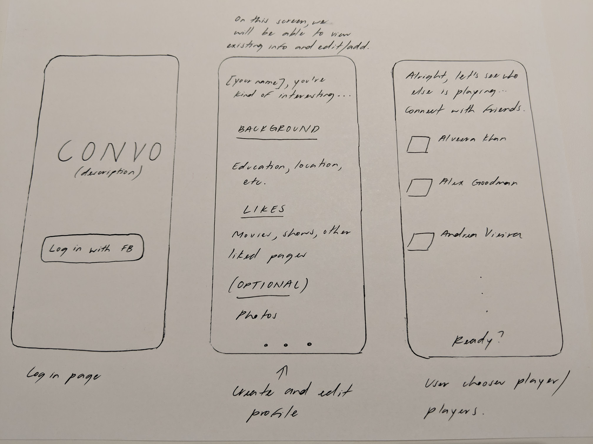
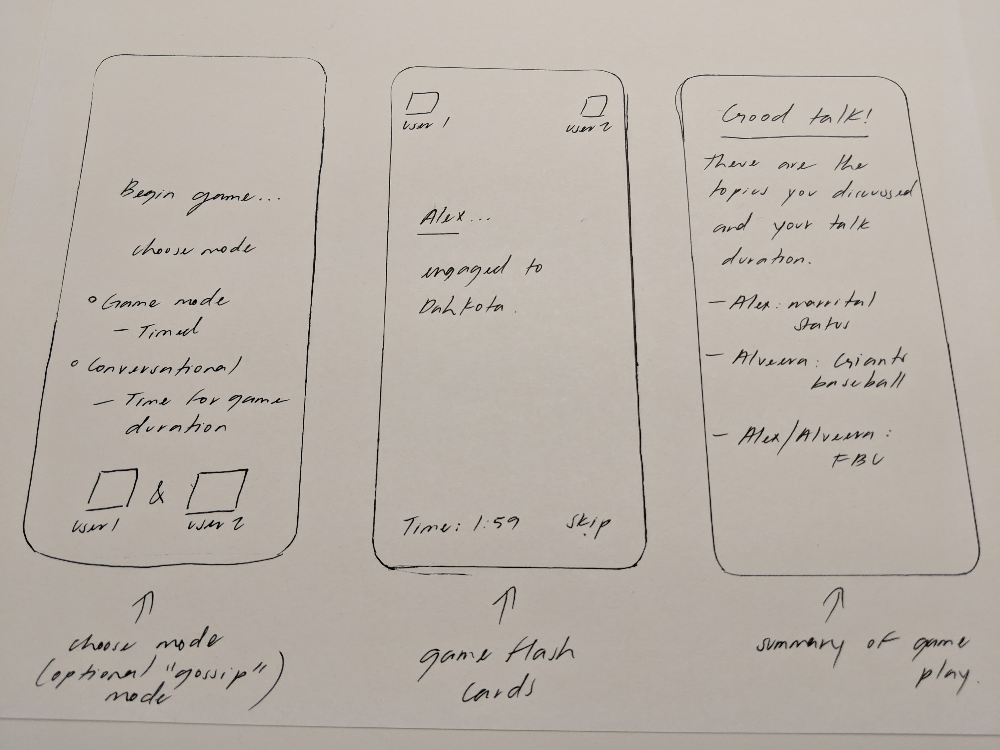

# convo 
### embrace the awkwardness
Conversation starter app for Facebook University 2018 group project

An app that encourages converastions between people based on their interests via a card game. From new acquaintances to old friends, convo dissipates the silence and brings out people's passions and memories.

[Heroku Parse Server](https://dashboard.heroku.com/apps/fbu-convo)

## Required User Stories
* [x] User is able to log in with Facebook
* [x] User is able to add to their profile's interests section
* [x] User can connect with Facebook friends who use the app
* [x] Users can view cards with conversation topics with interests when game starts
* [x] Users can skip cards and adjust time
* [x] Users will be shown a "game over" screen with the topics they discussed

## Optional User Stories
* [x] User can invite friends who don't already have app (on Connect page)
* [x] User can choose between two modes: game and conversation
* [ ] User can have Facebook memories and/or Instagram posts show up as cards
* [ ] More than two users can play the game
* [ ] Users will be shown their mutual friends and can "gossip"
* [ ] When users type in their additional likes, the app suggests Facebook pages for them to like

## Stretch User Stories
* [ ] Debate mode where users must take opposite sides of a trending topic (even if they actually agree) and argue

## Required Data Schema in Parse Server
* [x] ParseUser object with the following additional fields:
  * [x] Facebook user object
  * [x] Facebook pages liked
  * [x] additional likes entered by user (otherLikes)

## Wireframes

## Questions
* Should we store separate fields and edges from the Facebook user object as different columns in the Parse server or just save the one object whole?

# Considerations

## What is your product pitch?
* Problem: People sometimes have trouble starting conversations and making connections with the people around them, especially when meeting someone for the first time or trying to reach a better understanding of an established friend. 
* Solution: convo is an app that encourages converastions between people based on their interests via a card game. From new acquaintances to old friends, convo dissipates the silence and brings out people's passions and memories.

## Key Stakeholders
* Our app appeals broadly to anyone who has ever had trouble starting or continuing a conversation, or with organically learning more about their friends.

## What are the core flows/what will your final demo look like?
* See wireframes above

## What mobile features does the app leverage?
* Camera for taking pictures at the end
* "Deck of cards" view with swiping through cards
* Haptic feedback/vibration at the end of the game

## Technical concerns
* Making the timer show up and count down live without clicking on anything
* Making the deck of cards and binding the data to each item
* Animating the UI
* Connecting two users through Facebook (is it possible to have two users log in to get both of their interests?)

